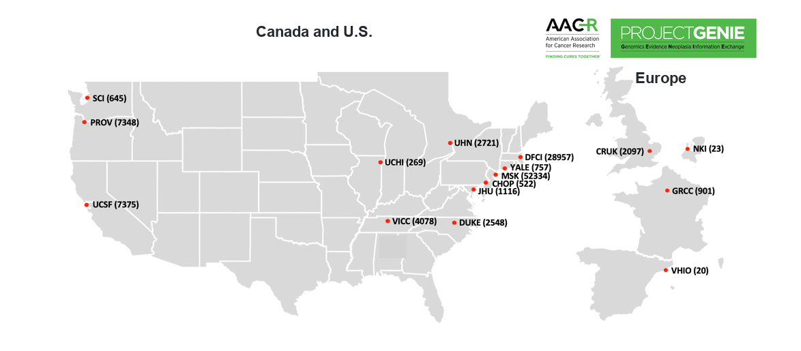
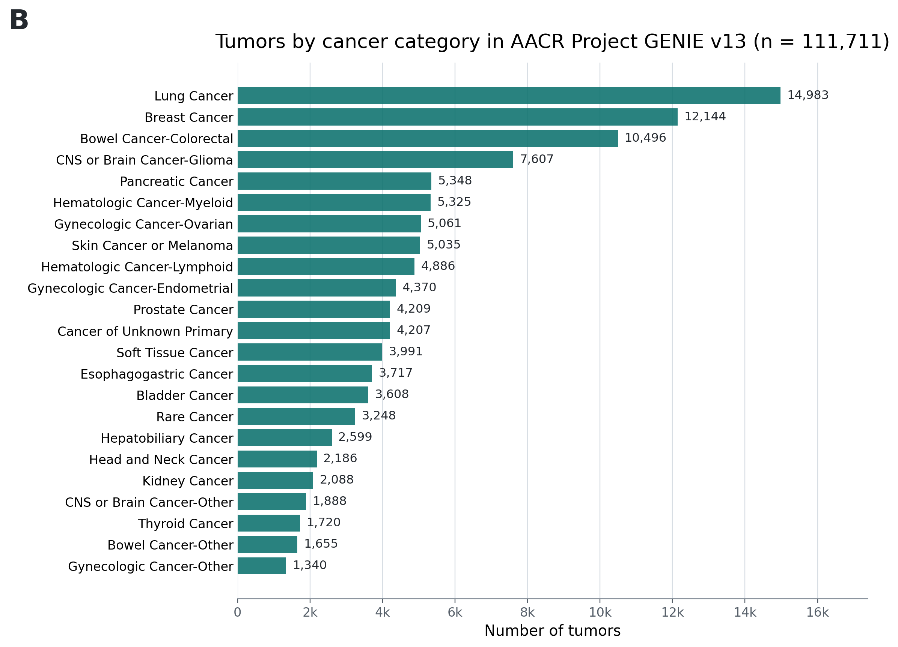
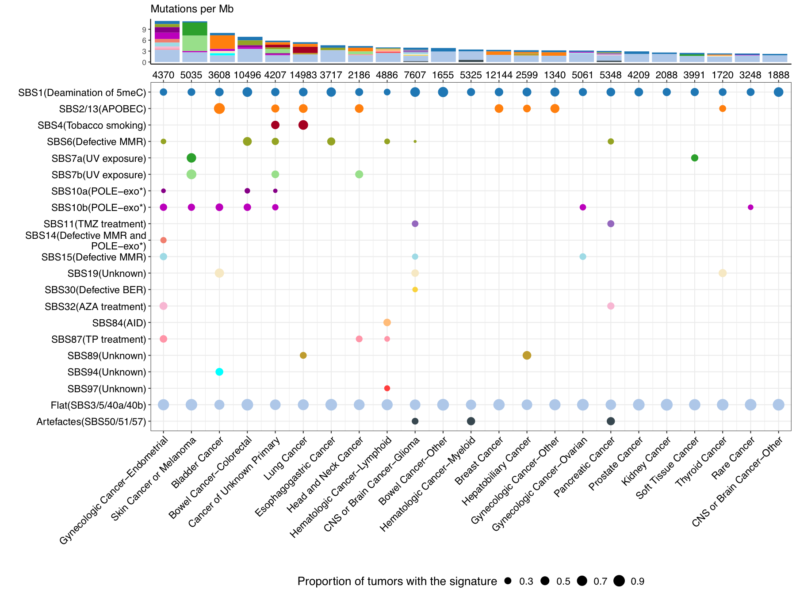
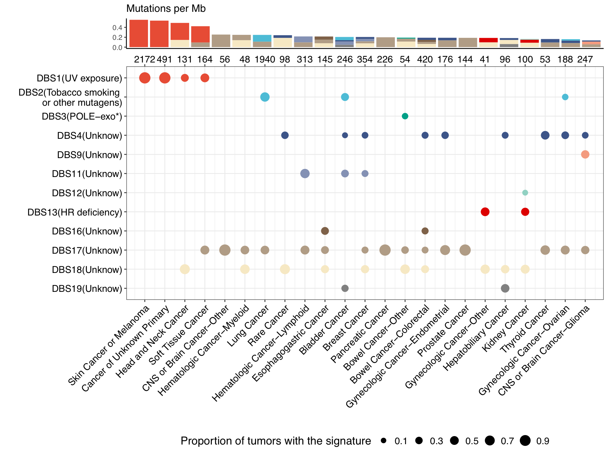

<div align="center">


<p>
  <strong>National Cancer Institute (NCI) Web Tools</strong><br>
  <a href="https://analysistools.cancer.gov/mutational-signatures/#/catalog/STS">Interactive targeted-sequencing signature catalogue</a><br>
  <a href="https://analysistools.cancer.gov/mutational-signatures/#/refitting">Online signature refitting tool</a>
</p>

[User Guide](https://github.com/binzhulab/SATS/blob/main/User_Guide_SATS_v1.0.8.md) | [User Guide PDF](https://github.com/binzhulab/SATS/blob/main/User_Guide_SATS_v1.0.8.pdf) | [R Manual](https://github.com/binzhulab/SATS/blob/main/SATS-manual.pdf) | [Project Webpage](https://github.com/binzhulab/SATS/tree/main/docs)

</div>

Signature Analyzer for Targeted Sequencing (SATS) is a panel-aware framework for mutational signature analysis in targeted sequencing data. Unlike tools developed primarily for whole-exome sequencing (WES) or whole-genome sequencing (WGS), SATS models panel-specific sequence context and mutation opportunity, enabling generation of SBS/DBS mutation count matrices from MAF-like mutation records, de novo signature extraction, mapping to tumor mutational burden (TMB)-normalized reference signatures, individual-tumor signature refitting and calculation of signature-attributed mutation burdens.

The accompanying manuscript applies SATS to 111,711 tumors from American Association for Cancer Research (AACR) Project GENIE (Genomics Evidence Neoplasia Information Exchange) to construct a real-world, panel-calibrated pan-cancer catalogue of targeted sequencing-derived mutational signatures. The package and repository support analysis of targeted-panel cohorts and use of the catalogue in settings where WES/WGS data are unavailable.

## Study and Catalogue Overview

SATS was developed using AACR Project GENIE version 13.0-public, a real-world targeted-sequencing cohort spanning clinical sequencing programs in North America and Europe.

<p align="center">
  <br>
  <em><strong>Figure 1A.</strong> AACR Project GENIE participating centers and sample counts used for the targeted-sequencing mutational-signature catalogue. Center labels show the participating-center acronym, and numbers in parentheses indicate the number of tumors contributed by that center.</em>
</p>

<p align="center">
  <br>
  <em><strong>Figure 1B.</strong> Distribution of 111,711 tumors across the 23 cancer categories used for downstream targeted-sequencing mutational-signature analysis.</em>
</p>

The resulting SATS catalogue includes **26 single base substitution (SBS) signatures** and **12 double base substitution (DBS) signatures** detected from targeted sequencing data. Dot size indicates the proportion of tumors carrying each signature within a cancer category, and the stacked bars summarize signature-attributed mutation burden.

<p align="center">
  <br>
  <em><strong>Figure 2A.</strong> Pan-cancer catalogue of 26 single base substitution (SBS) signatures detected from AACR Project GENIE targeted sequencing data using SATS. Rows represent cancer categories and columns represent SBS signatures. Dot size indicates the proportion of tumors carrying each signature within a cancer category, and stacked bars summarize signature-attributed mutation burden on the targeted-sequencing scale.</em>
</p>

<p align="center">
  <br>
  <em><strong>Figure 2B.</strong> Pan-cancer catalogue of 12 double base substitution (DBS) signatures detected from AACR Project GENIE targeted sequencing data using SATS. Rows represent cancer categories and columns represent DBS signatures. Dot size indicates the proportion of tumors carrying each signature within a cancer category, and stacked bars summarize signature-attributed mutation burden on the targeted-sequencing scale.</em>
</p>

---

## Quick Install

The current source version in this repository is **SATS v1.0.8**. The recommended installation route is the GitHub source tree:

```r
if (!requireNamespace("devtools", quietly = TRUE))
    install.packages("devtools")
devtools::install_github("binzhulab/SATS", subdir = "source", upgrade = "never")

library(SATS)
```

Alternatively, download `SATS_1.0.8.tar.gz` and install the source archive:

```bash
R CMD INSTALL SATS_1.0.8.tar.gz
```

SATS was formerly available from the [Comprehensive R Archive Network (CRAN)](https://CRAN.R-project.org/package=SATS). CRAN currently lists the package as archived, so the GitHub source installation above is the recommended route for the current version.

---

## National Cancer Institute (NCI) Web Tools

- [Interactive targeted-sequencing signature catalogue](https://analysistools.cancer.gov/mutational-signatures/#/catalog/STS): SBS and DBS signature frequencies, etiologies and cancer-type patterns from the targeted-sequencing catalogue.
- [Online signature refitting tool](https://analysistools.cancer.gov/mutational-signatures/#/refitting): web interface for targeted sequencing signature refitting.

---

## Workflow

SATS separates panel-context generation, de novo signature detection, signature mapping, individual-tumor refitting and burden calculation.

> Targeted sequencing data should not be analyzed as if all tumors shared the same mutation opportunity. SATS models the panel context directly, then estimates signatures and burdens on the targeted-sequencing scale.

<p align="center">
  
</p>

1. **Prepare matched mutation-count and panel-context matrices** from MAF-like mutation records, panel coordinates and sample-panel annotations using `GenerateVMatrix()` and `GenerateLMatrix()`.
2. **Detect de novo signatures** using panel-adjusted opportunity counts.
3. **Map reference signatures** with `MappingSignature()` and Catalogue of Somatic Mutations in Cancer (COSMIC) TMB-normalized signatures.
4. **Refit and estimate burdens** with `EstimateSigActivity()` and `CalculateSignatureBurdens()`.

---

## Basic Usage

### Generate matched V and L matrices from MAF-like mutation records

```r
data(SimData, package = "SATS")

sbs_file <- system.file(
    "extdata", "refitting_examples", "SBS_MAF_two_samples.txt",
    package = "SATS"
)
sbs_mut <- read.table(
    sbs_file, header = TRUE, sep = "\t", quote = "",
    stringsAsFactors = FALSE
)

clinical_sample <- data.frame(
    SAMPLE_ID = unique(sbs_mut$Tumor_Sample_Barcode),
    SEQ_ASSAY_ID = SimData$PatientInfo$SEQ_ASSAY_ID[1],
    stringsAsFactors = FALSE
)

V_mat <- GenerateVMatrix(
    mutation_record = sbs_mut,
    Class = "SBS",
    ref.genome = "hg19"
)

L_mat <- GenerateLMatrix(
    Panel_context = SimData$PanelEx,
    Patient_Info = clinical_sample,
    Class = "SBS",
    ref.genome = "hg19"
)

if (!setequal(colnames(V_mat), colnames(L_mat)))
    stop("V and L contain different sample IDs")
if (!setequal(rownames(V_mat), rownames(L_mat)))
    stop("V and L contain different mutation-context rows")

L_mat <- L_mat[rownames(V_mat), colnames(V_mat), drop = FALSE]
stopifnot(identical(colnames(V_mat), colnames(L_mat)))
stopifnot(identical(rownames(V_mat), rownames(L_mat)))
```

`GenerateVMatrix()` accepts MAF-like mutation records with `Chromosome`, `Start_Position`, `End_Position`, `Variant_Type`, `Reference_Allele`, `Tumor_Seq_Allele2` and `Tumor_Sample_Barcode`. `GenerateLMatrix()` accepts panel-coordinate information and a sample-panel annotation table containing `SAMPLE_ID` or `PATIENT_ID`, together with `SEQ_ASSAY_ID`. The returned `V` and `L` matrices should have identical row and column order before downstream SATS analysis.

### Generate an L matrix from panel coordinates

```r
data(SimData, package = "SATS")

PatientInfo <- SimData$PatientInfo[
    SimData$PatientInfo$SEQ_ASSAY_ID %in% unique(SimData$PanelEx$SEQ_ASSAY_ID),
]

L_mat <- GenerateLMatrix(
    Panel_context = SimData$PanelEx,
    Patient_Info = PatientInfo,
    Class = "SBS",
    SBS_order = "COSMIC",
    ref.genome = "hg19"
)
```

`GenerateLMatrix()` accepts panel coordinates with `Chromosome`, `Start_Position`, `End_Position` and `SEQ_ASSAY_ID`. The `ref.genome` argument supports `"hg19"` and `"hg38"`, with the corresponding Bioconductor reference genome package installed. `GeneratePanelSize()` remains available as a lower-level helper when users want to inspect panel-level context counts before expanding them to samples.

### Estimate signature activity and burden

```r
data(SimData, package = "SATS")
data(RefTMB, package = "SATS")

SBS.list <- c("SBS1", "SBS2_13", "SBS4", "SBS5", "SBS6", "SBS89")
W_star <- as.matrix(RefTMB$TMB_SBS_v3.4[, SBS.list])

H_hat <- EstimateSigActivity(V = SimData$V, L = SimData$L, W = W_star)
SigBdn <- CalculateSignatureBurdens(L = SimData$L, W = W_star, H = H_hat$H)
```

For single-tumor or small-cohort refitting, use a cancer-type-matched signature set from `RefTMB$SBS_refSigs` or `RefTMB$DBS_refSigs`.

---

## Repository Layout

- [`source/`](https://github.com/binzhulab/SATS/tree/main/source): current R package source, including preprocessing functions for MAF-like mutation records.
- [`SATS_1.0.8.tar.gz`](https://github.com/binzhulab/SATS/blob/main/SATS_1.0.8.tar.gz): source archive for the current version.
- [`User_Guide_SATS_v1.0.8.md`](https://github.com/binzhulab/SATS/blob/main/User_Guide_SATS_v1.0.8.md): current user guide.
- [`SATS-manual.pdf`](https://github.com/binzhulab/SATS/blob/main/SATS-manual.pdf): function-level R manual.
- [`Generating_L/`](https://github.com/binzhulab/SATS/tree/main/Generating_L): panel-context generation helper scripts and example panel files.
- [`nextflow/example1/`](https://github.com/binzhulab/SATS/tree/main/nextflow/example1): minimal Nextflow example for `GeneratePanelSize()`.
- [`docs/`](https://github.com/binzhulab/SATS/tree/main/docs): static project webpage for GitHub Pages.
- [`old_versions/`](https://github.com/binzhulab/SATS/tree/main/old_versions): older package archives.

---

## Software Quality

Unit tests are provided in `source/tests/testthat/` for the main user-facing functions, including `GenerateVMatrix()`, `GenerateLMatrix()`, `GeneratePanelSize()`, `CalculateSignatureBurdens()` and `EstimateSigActivity()`. The tests use simulated package data and small MAF-like mutation-record examples.

Run tests locally:

```bash
cd source
Rscript -e 'testthat::test_dir("tests/testthat")'
```

Run a local package check:

```bash
R CMD check source --no-manual
```

The repository also includes a GitHub Actions workflow, `.github/workflows/R-CMD-check.yaml`, that runs `R CMD check` on Linux, macOS and Windows. A Dockerfile is provided for building an R environment with SATS and its core genomic dependencies installed.

---

## Input Expectations

SATS accepts either summarized mutation-count and panel-context matrices or MAF-like mutation-record tables with panel-coordinate data frames. The package does not directly ingest raw Variant Call Format (VCF) or Browser Extensible Data (BED) files. VCF/BED-derived data should first be converted into MAF-like mutation records and panel-coordinate tables before running SATS.

The row order of the mutation catalogue matrix `V`, panel-context matrix `L` and reference signature matrix `W` must match. For SBS analyses, the `SBS_order` argument controls mutation-type ordering only; the COSMIC reference-signature version used for mapping is controlled separately by `MappingSignature(COSMICv=...)`, with `"v3.4"` as the current default.

---

## Citation

If you use SATS or the targeted-sequencing mutational-signature catalogue, please cite:

Lee et al., "A real-world pan-cancer catalogue of mutational signatures from 111,711 tumors" (submitted).
